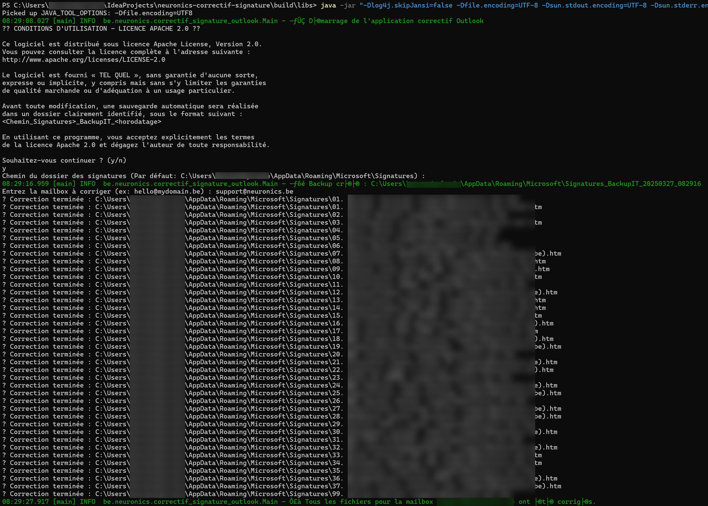

# Correctif d'encodage pour signatures Outlook

Ce programme corrige les problèmes d'encodage des signatures Outlook mal interprétées en `charset=windows-1252`, généralement causées par l'“option de stockage cloud des signatures” activée dans Microsoft Outlook 365.

---

## 🔖 Problème identifié

Depuis mi-2023, de nombreux utilisateurs signalent que les caractères accentués (ex : à, é, ç, etc.) disparaissent ou sont corrompus dans les signatures Outlook. Cela se manifeste typiquement par des caractères comme :

```
é, à , è, ô, ê, –, “, etc.
```

Ces caractères erronés sont le résultat d'un double encodage (UTF-8 mal relu comme Windows-1252).

---

## 🌐 Liens de référence sur le sujet

- Reddit : [Caractères bizarres dans Outlook](https://www.reddit.com/r/sysadmin/comments/1jjg9rz/weird_characters_in_outlook_signatures/?tl=fr&rdt=54154)
- Borncity : [Signatures Outlook avec trémas](https://borncity.com/win/2025/03/20/microsoft-outlook-signatures-in-cloud-storage-without-umlauts/)

---

## 📄 Fonctionnement du correctif

Ce programme analyse tous les fichiers `.htm` d'un dossier de signatures Outlook donné (par exemple pour `support@neuronics.be`), identifie les caractères corrompus, et les corrige automatiquement.

**Avant toute modification, une sauvegarde complète est réalisée automatiquement**, sous la forme :

```
C:\Users\%USERNAME%\AppData\Roaming\Microsoft\Signatures_BackupIT_YYYYMMDD_HHmmss
```

---

## ⚙️ Exécution du programme

🧰 Compilation ou utilisation

Le programme est écrit en Java 21 et nécessite Gradle pour être compilé. Le fichier fourni (JAR) est destiné à être exécuté avec une JRE 21.

👉 Si vous n'avez pas encore Java 21, vous pouvez le télécharger gratuitement depuis :

https://adoptium.net/

⚠️ Si le JAVA_HOME ou le PATH de votre système ne sont pas correctement configurés pour pointer vers Java 21, vous devrez les adapter manuellement. Veuillez vous référer à la documentation officielle de votre système d’exploitation ou de Java.

### Par défaut, les signatures Outlook sont stockées ici :

```text
C:\Users\%USERNAME%\AppData\Roaming\Microsoft\Signatures
```

### Pour exécuter le correctif :

```cmd
java -jar "-Dlog4j.skipJansi=false -Dfile.encoding=UTF-8 -Dsun.stdout.encoding=UTF-8 -Dsun.stderr.encoding=UTF-8" .\neuronics-outlook-correctif-encodage-signature-2025-1.0.0.jar
```

Le programme demandera ensuite :

- Le chemin du dossier de signatures (par défaut : celui précité)
- L'adresse e-mail concernée (ex : `hello@mydomain.be`)

Puis il recherchera tous les fichiers `.htm` contenant cette adresse dans leur nom, et procédera à la correction.





---

## ⚠️ Cause principale du problème

La fonctionnalité **"Stocker mes paramètres Outlook dans le cloud"** active une synchronisation automatique des signatures, qui semble mal gérer les encodages de certains caractères (notamment les trémas ou accents).

Cela concerne principalement les versions Outlook 365 (canal entreprise ou courant depuis 2023).

---

## 🔒 Solution de contournement de contournement (non testée)

Il est possible de **désactiver la synchronisation des signatures** via la base de registre Windows :

```reg
[HKEY_CURRENT_USER\Software\Microsoft\Office\16.0\Outlook\Setup]
"DisableRoamingSignaturesTemporaryToggle"=dword:00000001
```

En complément, le correctif reconstruit les signatures locales sans modifier l'encodage d’origine HTML (la balise `meta charset=windows-1252` est conservée).

---

## 🚫 Avertissement

Ce programme est fourni **tel quel**, sans aucune garantie. Il est sous **licence Apache 2.0**. Vous pouvez l'utiliser librement, mais **l'auteur ne pourra être tenu responsable** en cas de mauvaise utilisation ou de perte de données.

Un dossier de sauvegarde est toujours créé automatiquement avant toute modification.

---

## 📄 Besoin d'aide ?

- Pour une aide sur l'utilisation du correctif : **[support@neuronics.be](mailto:support@neuronics.be)**
- Pour une suggestion ou une demande de fonctionnalité : merci d'ouvrir une **issue sur ce dépôt GitHub**.
